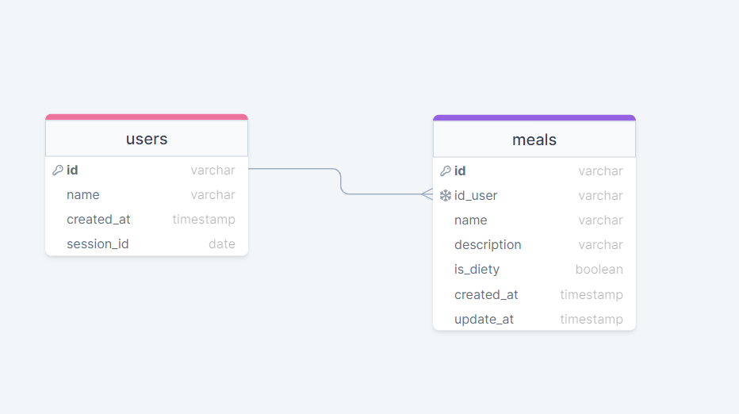

# Daily-Diety-API

  <a href="#sobre">Sobre</a> &#xa0; | &#xa0;
  <a href="#tecnologias-utilizadas">Tecnologias</a> &#xa0; | &#xa0;
  <a href="#autor" >Autor</a>

## Sobre ##
Desafio prático, desenvolvimento de uma API RESTfull para controle de dieta diária.  

## 💻  Regras da aplicação ##

- [x] Deve ser possível criar um usuário
- [x] Deve ser possível identificar o usuário entre as requisições
- [x] Deve ser possível registrar uma refeição feita, com as seguintes informações:
  > *As refeições devem ser relacionadas a um usuário.*
  - Nome
  - Descrição
  - Data e Hora
  - Está dentro ou não da dieta
- [x] Deve ser possível listar todas as refeições de um usuário
- [x] Deve ser possível visualizar uma única refeição
- [x] Deve ser possível editar uma refeição, podendo alterar todos os dados acima
- [x] Deve ser possível apagar uma refeição
- [] Deve ser possível recuperar as métricas de um usuário
  - [] Quantidade total de refeições registradas
  - [] Quantidade total de refeições dentro da dieta
  - [] Quantidade total de refeições fora da dieta
  - [] Melhor sequência de refeições dentro da dieta
- [x] O usuário só pode visualizar, editar e apagar as refeições o qual ele criou

## Tecnologias Utilizadas ##

- [NodeJs](https://nodejs.org/en)
- [TypeScript](https://www.typescriptlang.org/)
- [Fastify](https://fastify.dev)
- [Knex.Js](https://knexjs.org)

## Licença ##

Este projeto está sob licença MIT. Para mais informações acesse [LICENSE](LICENSE.md).

## Autor ##
Feito por <a href="https://github.com/Reydson-Martins" target="_blank">Reydson Martins</a>

&#xa0;

<a href="#top">Voltar ao topo</a>
